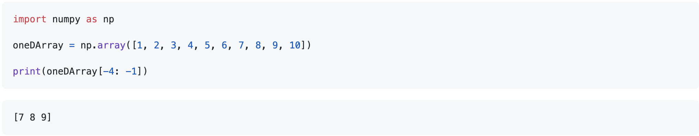
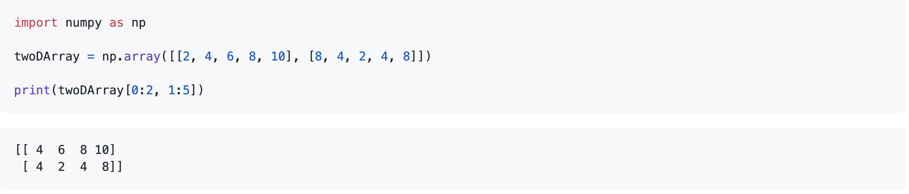

### Slicing 1D and 2D Lists/Arrays:

Welcome to my slicing values topic! Slicing values is a method used to access certain values by their index within a list. 

Comprehending how to slice values from a list or an array correctly is something I learnt early on as being imperative to prevent `logical errors`. Afterwards, I will go into additional simple examples of 1D and 2D slicing of lists, and provide a more realistic example. 

**Please view my verbal demonstration on 1D array slicing:** [Demonstration Video](https://web.microsoftstream.com/video/74a2f817-cb5b-4a93-a108-637a08793719)

After viewing my demonstration, I'd like to highlight a couple key takeaways. These include:
- Slicing from a 1D list/array takes the following form: **[X, Y]**
- **X** is the first index value where we would like to begin slicing from, and it's corresponding value in the list or array is **included**. 
- **Y** is the second index value we would like to end our slice at, and its corresponding value in the list or array is **not included**. 
- **Index values** start at **zero**. 

**With this in mind, here are some further simple examples:** 

**Slicing 1D Array**: 

  

**Slicing 2D Array**:

  

**To demonstrate this skill in practice, here is a realistic example using slicing and the Pandas dataframe `ILOC method`:** 

Practical Example using slicing and ILOC: [Practical Example](PracticalExample.md)

**Jargon Listed in this Topic:**
- **Logical errors:** Logical errors are errors that do not cause the program to terminate abnormally, but instead are mistakes in a program's code that cause it to produce an unexpected or incorrect response or calculation. 
- **Pandas ILOC method:** The ILOC method returns rows from a dataframe given an inputted integer slice. 
