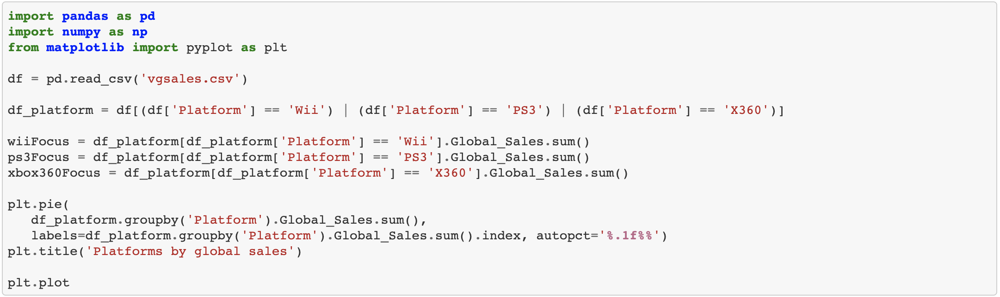

### Exploratory Data Analysis:

Welcome to my Exploratory Data Analysis (EDA) topic! EDA involves analyzing our previous descriptive statistics, and effectively visualize the summary. 
Carrying on with my previous topic in descriptive statistic and manipulating dataframes, the following code summarizes and prints the results of this study with a pie chart:

**Code:**

  

**Graph:**

  

If you have any questions about the code that's applied in this example, please take a look at my previous topic on descriptive statistics for a summary!
