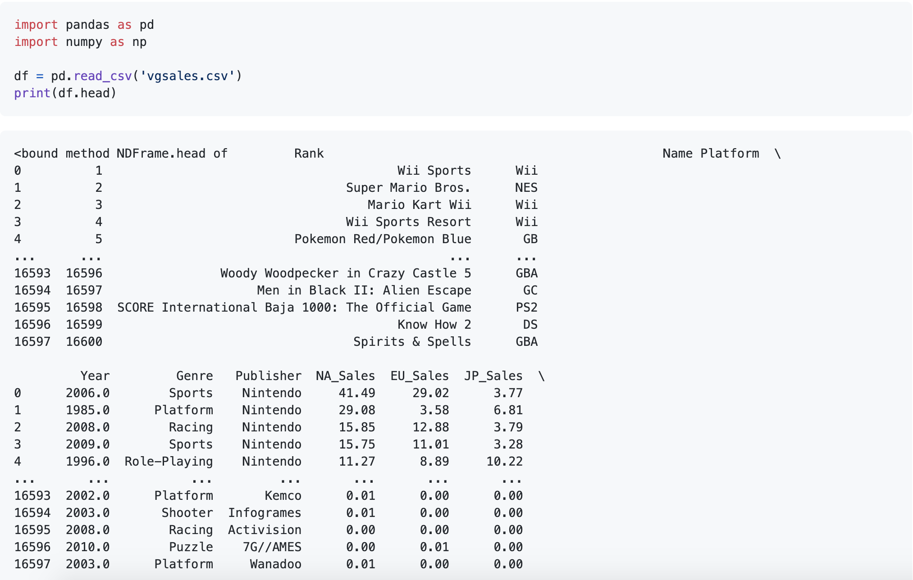
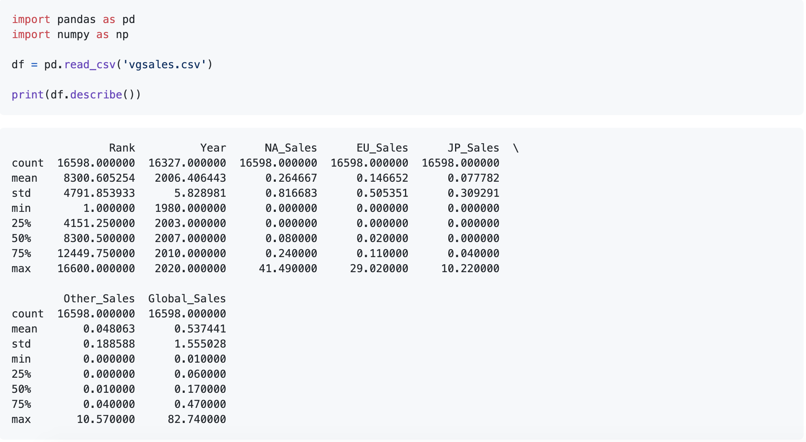
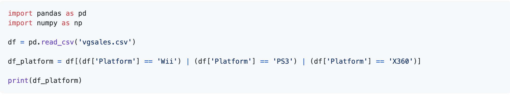
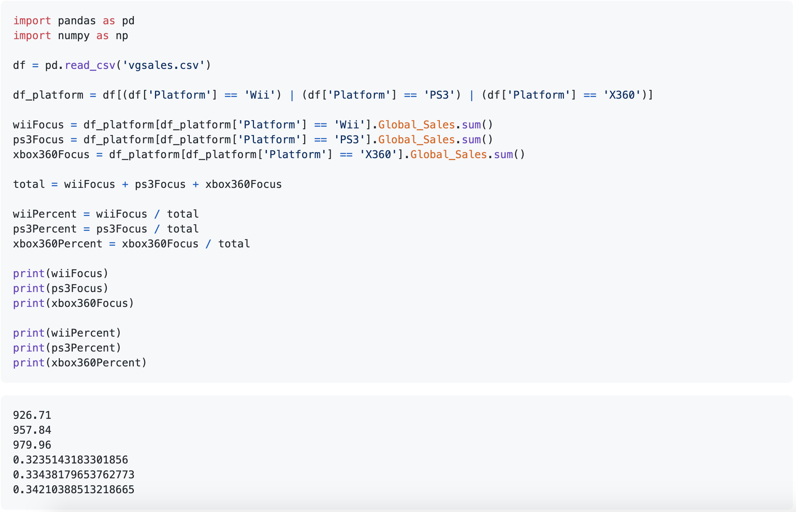

### Descriptive Statistics and Manipulation of Dataframes:

Welcome to my descriptive statistics and manipulation of dataframes topic!

Some methods I'll be using in my example of manipulating a dataframe include:
- `head`: Provides the option to view the first n items in our dataframe.
- `type`: Provides the type of data we are working with
- `describe`: Provides an overall view of the descriptive statistics 
- `unique`: Provides a list of unique values within that column

To understand the use of these methods, we'll first import a dataframe. The dataframe is a list of the highest selling video games.
- **Importing a data file:** 

  

Next, we'll take a look at some of the descriptive statistics using describe()
- **Describe():** 

  

Now that we have a datafile imported and we know what it looks like, let's filter out the Platform column we're interested in, and see the unique values. As we can see, there are quite a few unique values. Therefore, we are going to take a look at the newer platforms in the data (XBOX360, Wii, PS3):
- **Selecting the columns and rows we're interested in:**

  

Lastly, let's calculate the total sales each platform has made with their collection of games in global sales, and calculate that as a percentage of a whole for all three platforms:
- **Calculating total sales, and sorting percentages:** 

  

As we can see from our calculations of total sales, the three platforms are fairly close in global sales. It's important to note however, that the xbox360 was released a year earlier than the other platforms we are discussing. 
