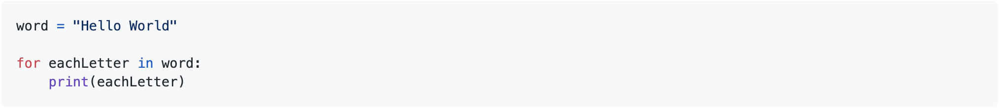
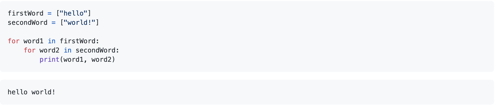

### For Loops and Nested Loops:

Welcome to my For Loops demonstration! A For loop is an effective tool to itterate through a sequence. This sequence may be a list, array, or a dictionary for example.

Simply, the structure of a For Loop appears as such: 

  

**To hear my verbal explanation on the basic For Loop structure, please take a look at the following [Demonstration Video](https://web.microsoftstream.com/video/bcbfac9f-b6d4-4b89-b8fa-1b0a4a1d7938)!**

The basic structure of a nested For Loop may appear as such:

  

**To hear my verbal explanation on the nested For Loop structure, please take a look at the following [Demonstration Video](https://web.microsoftstream.com/video/a01ded44-b26d-4b0f-b75b-d6930967aa36)!**

